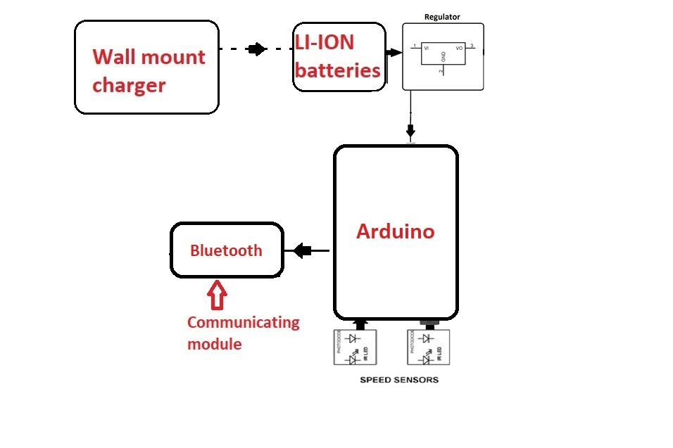

# Capstone-project

## IOT BASED  CAR OVER SPEED DETECTION SYSTEM 
This repository is created  for completing our capstone project as a professional means of communication platform  between  group members as well as our project guide.

### Project description:
Over-speeding of cars has caused many road accidents over the years. There needs to be a system which can detect the over speeding of cars. When a car goes beyond the prescribed speed limit, a detection system should be able to detect it.The system consists of a trasnmitter part(Arduino) which has two sensors to calculate travel time of purticular vehicle between the two points. This data is sent to reciever part(Beaglebone) using bluetooth from where the speed is calculated and if its over speed the speed of vehicle will be uploaded to cloud.  Also, the system will be able to display the speed of the given vehicle on the screen. 

#### Block diagram:
Block diagram of Beaglebone side:

Block diagram for Arduino side

#### Hardware and Software Requirements:
   1.Beaglebone Black
   
   2.Lamp
   
   3.IR Sensor
   
   4.Regulator
   
   5.LCD
   
   6.Buzzer
   
   7.Relay
   
   8.WIFI module (ESP8266)
   
   9.Arduino IDE, Eclipse IDE,Easy EDA
   
   10.Bluetooth 4.0
   
   11.MC Programming Language: C

Group members - Sunny devgan, Varundeep singh, Govind raj

Project guide - Prof. Dr. Mike Aleshams

   #### PROJECT ON PROGRESS                                                                                                                                                                                                                                                                      
